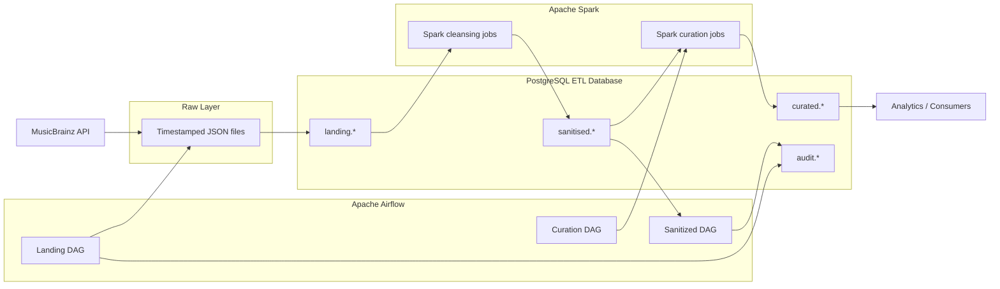

# Music Catalog ETL

A batch data engineering pipeline for ingesting music metadata from the MusicBrainz API, storing source payloads in PostgreSQL, transforming them with Spark, and producing sanitized and curated datasets.

The repository is structured as a shared ETL codebase. Common utilities are designed to be reused across pipeline sources, phases, and entity groups rather than being tied to a single developer or a single table.

## Overview

The current implementation follows this general flow:

```text
MusicBrainz API
      |
      v
Raw JSON files
      |
      v
Landing PostgreSQL
      |
      v
Spark cleansing / transformation
      |
      v
Sanitized PostgreSQL
      |
      v
Curated PostgreSQL
      |
      v
Analytics / downstream consumption
```

Airflow orchestrates the individual stages, while PostgreSQL stores the warehouse layers and audit information.

The current implementation uses `cv1` as the configured source-system identifier and `catalog_core_v1` as the package/DAG naming used by the current pipeline. These names are implementation identifiers; the reusable scripts are parameterized so that additional source systems, phases, table groups, and entities can follow the same pattern.

## Architecture



The important design point is that orchestration, transformation, storage, and audit are separate concerns:

- **Airflow** controls execution order.
- **Python utilities** handle ingestion, database loading, batch handling, archival, and reconciliation.
- **Spark** performs JSON parsing and cleansing into relational structures.
- **PostgreSQL** stores landing, sanitized, curated, and audit data.
- **Raw JSON** provides a persisted copy of the extracted source payload before transformation.

## Data Flow

### 1. Batch initialization

Each pipeline run starts by generating an ETL batch ID.

The batch ID is created by:

```text
generic_scripts/batch_id_generation.py
```

The script accepts:

```text
<source_system> <phase_name>
```

For example:

```text
python generic_scripts/batch_id_generation.py cv1 landing
```

The generated ID follows the current pattern:

```text
YYYYMMDDHHMMSS_<source_system>
```

The initial batch is recorded in:

```text
audit.batch_log
```

with status:

```text
S = Started
C = Completed
E = Error
```

Before creating a new batch, the utility checks for an incomplete batch for the same source system and phase. This prevents a new batch from being opened while an earlier batch is still incomplete.

The generated batch ID is also written under:

```text
configs/<source_system>_batch_id.txt
```

Downstream utilities use this value to associate records with the current execution.

### 2. Source ingestion

The current MusicBrainz ingestion implementation is under:

```text
ingestion/catalog_core_v1/
```

The ingestion code uses the shared MusicBrainz client:

```text
generic_scripts/utils/musicbrainz_client.py
```

The current implementation discovers a sample of artists, retrieves their releases, and follows relevant release relationships to obtain URL information.

The raw responses are stored under:

```text
data/raw/
├── artists/
├── releases/
└── urls/
```

The exact entities processed by a pipeline are controlled by the ingestion implementation rather than being assumed globally by the framework.

### 3. Landing load

The reusable landing loader is:

```text
generic_scripts/load_tables_landing.py
```

It accepts parameters for the source/entity, destination schema/table, and source-system identifier.

The loader:

1. Reads the latest matching raw JSON file.
2. Connects to PostgreSQL.
3. Reads the destination table structure.
4. Maps the source payload into the target table.
5. Stores the original payload in the landing `JSONB` column.
6. Associates the inserted records with the current ETL batch.
7. Commits the load.

The current landing DAG invokes the loader for:

```text
artists
releases
urls
```

The repository also contains recordings-related definitions, but recordings are not currently part of the active landing DAG.

### 4. Landing reconciliation

After landing loads complete,:

```text
generic_scripts/landing_anr.py
```

performs an audit-and-reconciliation check.

The utility compares:

```text
raw JSON record count
        vs
landing table record count for the current batch
```

The result is written back to:

```text
audit.batch_log
```

A matching count marks the phase as completed. A mismatch marks it as failed and records the difference.

### 5. Raw-file archival

The landing pipeline also runs:

```text
generic_scripts/landing_archival.py
```

This removes older raw files and retains a limited recent history.

This keeps raw data available for short-term reload/debugging without allowing the local raw directory to grow indefinitely.

### 6. Sanitization

The sanitized DAG runs Spark applications in parallel for the active entity groups:

```text
cleansing/catalog_core_v1/clean_artist_data.py
cleansing/catalog_core_v1/clean_release_data.py
cleansing/catalog_core_v1/clean_urls_data.py
```

Each Spark job:

- reads landing data from PostgreSQL,
- parses the stored JSON payload using a Spark schema,
- extracts required nested fields,
- normalizes the structure,
- writes relational records into the sanitized schema.

The current active sanitized tables are:

```text
sanitised.san_artists
sanitised.san_releases
sanitised.san_urls
```

### 7. Sanitized reconciliation

The generic utility:

```text
generic_scripts/sanitised_anr.py
```

compares the landing and sanitized record counts for a given source table/target table pair.

Its parameters are:

```text
<landing_schema>
<landing_table>
<sanitised_schema>
<sanitised_table>
<source_system>
<group_name>
```

This allows the same reconciliation utility to be reused for multiple entity groups.

The result is inserted into:

```text
audit.recon_log
```

The sanitized phase is then summarized through:

```text
generic_scripts/batch_log_insertion.py
```

which updates the corresponding batch-level audit status.

### 8. Curation

The current curation DAG runs:

```text
curation/catalog_core_v1/cur_artist_discography_summary.py
```

It reads sanitized artist/release data and produces:

```text
curated.cur_artist_discography_summary
```

The current summary contains artist-level discography metrics such as release counts, release-group counts, average track counts, and release-date ranges.

There is also a second curation script for label/release summaries, but it is currently a placeholder rather than a complete curated implementation.

## Pipeline Orchestration

The repository currently has three main DAGs:

| DAG | Purpose |
|---|---|
| `catalog_core_v1_landing` | Batch initialization, ingestion, landing load, landing reconciliation, and raw-file archival |
| `catalog_core_v1_sanitised` | Spark cleansing and landing-to-sanitized reconciliation |
| `catalog_core_v1_curation` | Spark-based curated dataset generation |
| `test_dag` | Test/placeholder Airflow DAG |

The current schedules are defined in the DAG files. The landing, sanitized, and curation DAGs use the same daily schedule in the current implementation.

The stages are currently represented as separate DAGs rather than one DAG spanning the entire warehouse flow.

## Database Model

The PostgreSQL ETL database is divided into four logical schema families.

### Landing

```text
landing.lnd_artists
landing.lnd_releases
landing.lnd_recordings
landing.lnd_urls
```

The landing layer retains the source representation.

Typical landing fields include:

- source entity ID
- `payload` as `JSONB`
- ETL batch ID
- creation/update timestamps

`lnd_releases` also carries the artist identifier used when retrieving the release data.

Recordings exist in the database model, but the current active pipeline does not process recordings through the full landing-to-sanitized flow.

### Sanitized

```text
sanitised.san_artists
sanitised.san_releases
sanitised.san_urls
```

The sanitized layer converts nested MusicBrainz JSON into structured relational columns.

Examples of fields exposed by the current transformation include:

- artist name
- artist ID
- release title
- release ID
- area
- label
- URL
- URL domain/type

A recordings sanitized definition exists in the SQL layer, but there is currently no active recordings Spark task in the sanitized DAG.

### Curated

The current implemented curated output is:

```text
curated.cur_artist_discography_summary
```

It is derived from the sanitized layer and is intended for analytical consumption rather than source-level storage.

### Audit

Two audit tables are central to the pipeline:

```text
audit.batch_log
audit.recon_log
```

`audit.batch_log` tracks execution at the batch/phase level.

Important fields include:

- `etl_batch_id`
- `phase_name`
- `source_system`
- `batch_status`
- processed record count
- failed record count
- error message
- timestamps

`audit.recon_log` stores table-level reconciliation results.

Important fields include:

- `etl_batch_id`
- `phase_name`
- `source_system`
- source table
- target table
- group name
- processed/failed counts
- reconciliation status
- timestamps

## Generic ETL Design

A key characteristic of the current codebase is the use of generic utilities for operations that are common across entities and pipeline groups.

### Source system

The source is passed as a parameter rather than embedded in the audit utilities.

Current example:

```text
cv1
```

### Phase

Pipeline phases are represented explicitly:

```text
landing
sanitised
curated
```

### Entity

The landing and reconciliation utilities accept table/entity information as arguments.

For example:

```text
artists
releases
urls
```

### Group

Sanitized reconciliation supports a group identifier:

```text
group1
```

This provides a way to associate several tables that belong to the same logical processing group.

The important point is that `group1` is not a hard-coded business rule in the reconciliation framework. It is supplied by the DAG and can be changed when another entity group is introduced.

### Batch

The ETL batch ID provides the link between stages.

Conceptually:

```text
source_system
      +
phase
      +
etl_batch_id
      |
      +--> landing records
      +--> sanitized records
      +--> reconciliation results
      +--> batch status
```

This makes the audit utilities reusable when another source system or pipeline is added.

## Audit and Reconciliation

The pipeline uses two levels of validation.

### Landing ANR

```text
Raw file count
      |
      v
Landing table count
```

The result updates `audit.batch_log`.

### Sanitized ANR

```text
Landing table count
      |
      v
Sanitized table count
```

The result is inserted into `audit.recon_log`.

Multiple table comparisons can therefore belong to the same logical group, for example:

```text
Group 1
├── landing.lnd_artists      -> sanitised.san_artists
├── landing.lnd_releases     -> sanitised.san_releases
└── landing.lnd_urls         -> sanitised.san_urls
```

A future group can use the same utility with different source/target tables and a different group identifier.

## Technology Stack

| Technology | Role |
|---|---|
| Python | Ingestion, database utilities, audit/reconciliation, file management |
| Apache Airflow | Pipeline orchestration |
| PostgreSQL | Landing, sanitized, curated, and audit storage |
| Apache Spark | JSON parsing, cleansing, and curated transformations |
| MusicBrainz API | External metadata source |
| Docker / Docker Compose | Local runtime environment |
| pgAdmin | PostgreSQL administration |

The current repository does not show an active implementation of DBT, Kafka, Snowflake, Redis, or AWS services.

## Repository Structure

```text
Music_Catalog_ETL/
├── airflow/
│   └── dags/
│       ├── catalog_core_v1_landing.py
│       ├── catalog_core_v1_sanitised.py
│       ├── catalog_core_v1_curation.py
│       └── test_dag.py
│
├── ingestion/
│   └── catalog_core_v1/
│       └── ingestion_artists_etl_landing.py
│
├── generic_scripts/
│   ├── batch_id_generation.py
│   ├── batch_log_insertion.py
│   ├── landing_anr.py
│   ├── landing_archival.py
│   ├── load_tables_landing.py
│   ├── load_tables_sanitised.py
│   ├── sanitised_anr.py
│   └── utils/
│
├── cleansing/
│   └── catalog_core_v1/
│       ├── clean_artist_data.py
│       ├── clean_release_data.py
│       └── clean_urls_data.py
│
├── curation/
│   └── catalog_core_v1/
│       ├── cur_artist_discography_summary.py
│       └── cur_label_release_summary.py
│
├── sql/
│   ├── landing/
│   ├── sanitised/
│   ├── curated/
│   └── audit/
│
├── data/
│   └── raw/
│
├── configs/
├── spark/
├── transformations/
├── tests/
├── docker-compose.local.yml
├── docker-compose.shared.yml
├── entrypoint.sh
├── pyproject.toml
└── requirements.txt
```

The `generic_scripts/` directory is intentionally separate from the source-specific packages. Shared batch, loading, audit, and reconciliation behavior should remain reusable when another pipeline or entity group is introduced.

## Docker Environment

The Compose files define the local runtime environment.

The stack contains:

- PostgreSQL for Airflow metadata
- PostgreSQL for ETL/warehouse data
- Airflow webserver
- Airflow scheduler
- Spark master
- Spark worker
- pgAdmin

The ETL PostgreSQL service is named:

```text
postgres-etl
```

The database used by the ETL utilities is:

```text
music_catalog
```

The Airflow metadata database is separate.

The local Compose configuration maps the primary interfaces to host ports including:

```text
Airflow: 8082
Spark UI: 8080
pgAdmin: 5050
ETL PostgreSQL: 5434
```

The exact service configuration should be taken from the selected Compose file rather than assumed from the README.

## Setup

The repository is designed around Docker Compose.

Prerequisites:

- Docker
- Docker Compose
- Python 3.12+ for local Python tooling
- Network access to the MusicBrainz API

The current local Compose startup command is:

```bash
docker compose -f docker-compose.local.yml up --build
```

Airflow is available through the webserver port configured in Compose.

The project mounts the repository into the relevant containers, so the DAGs and scripts are available inside the runtime environment.

## Running Individual Utilities

The generic utilities expose parameterized command-line interfaces.

### Generate a batch

```bash
python generic_scripts/batch_id_generation.py <source_system> <phase_name>
```

Example:

```bash
python generic_scripts/batch_id_generation.py cv1 landing
```

### Load a landing table

```bash
python generic_scripts/load_tables_landing.py \
    <source_name> \
    <schema_name> \
    <table_name> \
    <source_system>
```

Example:

```bash
python generic_scripts/load_tables_landing.py artists landing lnd_artists cv1
```

### Landing reconciliation

```bash
python generic_scripts/landing_anr.py \
    <source_name> \
    <schema_name> \
    <table_name> \
    <source_system>
```

### Sanitized reconciliation

```bash
python generic_scripts/sanitised_anr.py \
    <landing_schema> \
    <landing_table> \
    <sanitised_schema> \
    <sanitised_table> \
    <source_system> \
    <group_name>
```

### Batch-log update after reconciliation

```bash
python generic_scripts/batch_log_insertion.py \
    <group_name> \
    <source_system>
```

These utilities are intentionally parameterized. When a second entity group or another source is introduced, the expected approach is to pass the new source/table/group values rather than create a separate copy of the generic utility.

## Current Implementation

The current repository has working implementations for:

- MusicBrainz API ingestion
- Raw JSON persistence
- Batch ID generation
- Landing database loading
- Landing reconciliation
- Raw-file archival
- Spark-based artist cleansing
- Spark-based release cleansing
- Spark-based URL cleansing
- Sanitized reconciliation
- Batch-level audit updates
- Artist discography curation
- Dockerized Airflow, PostgreSQL, Spark, and pgAdmin

The current active data path is primarily:

```text
Artists
Releases
URLs
```

Recordings are present in parts of the data model but are not currently wired through the active end-to-end DAGs.

## Current Pipeline Dependencies

The current landing DAG follows this order:

```text
start
  |
  v
batch_id_generation
  |
  v
ingest_artist_data
  |
  v
load_artist_data
  |
  v
load_release_data
  |
  v
load_urls_data
  |
  v
landing_anr_artist
  |
  v
landing_anr_releases
  |
  v
landing_anr_urls
  |
  v
landing_archival
  |
  v
end
```

The sanitized DAG runs the three active Spark cleansing jobs in parallel:

```text
                    +--> clean_artist_data --> sanitised_anr_artist --+
start -->           |                                                 |
                    +--> clean_release_data -> sanitised_anr_releases +--> batch_log_insertion --> end
                    |                                                 |
                    +--> clean_urls_data ----> sanitised_anr_urls ---+
```

The curation DAG currently has a single active Spark task:

```text
start
  |
  v
cur_artist_discography_summary
  |
  v
end
```

## Important Engineering Considerations

### Keep generic utilities generic

The shared utilities under `generic_scripts/` should operate on parameters such as:

```text
source_system
phase_name
schema_name
table_name
group_name
```

rather than embedding assumptions about a particular entity.

Source-specific behavior belongs in the corresponding ingestion, cleansing, or curation package.

### Batch IDs are the cross-stage identifier

When adding a new processing stage, ensure the current batch ID is propagated and used consistently.

Do not generate unrelated batch IDs for every table within the same phase unless that behavior is intentionally required.

### Grouping is a pipeline concern

A group can represent a set of tables that should be reconciled or audited together.

For example:

```text
group1:
  artists
  releases
  urls
```

A different pipeline can define another group without changing the generic reconciliation implementation.

### Landing preserves source payloads

The landing layer should retain the source payload rather than applying the full business transformation immediately.

The Spark cleansing layer is responsible for converting nested JSON into the structured sanitized model.

### Do not treat filenames as the batch identifier

Raw files are date/timestamp based, while the audit framework uses `etl_batch_id`.

The batch ID is the authoritative execution identifier for audit and reconciliation.

## Known Limitations

The current repository still has areas that require further development:

- The active pipeline is focused on a limited set of MusicBrainz entities.
- Recordings are not currently wired through the active landing and sanitized DAGs.
- The second curation path for label/release summaries is incomplete.
- The test suite is currently minimal.
- Database credentials are currently present in local configuration/source and should be externalized.
- Database bootstrap and runtime schema assumptions should remain aligned with the SQL definitions.
- The current DAGs are separate by phase; an explicit cross-DAG dependency mechanism is not currently shown.
- The current pipeline is batch-oriented rather than streaming.
- Monitoring and alerting are primarily based on Airflow task state and application logging.
- The project does not currently provide a mature CI/CD workflow.
- Spark is used for active cleansing/curation, but the transformation layer is still relatively small.

## Live Showcase

> TODO: Finalize the live showcase.

A useful demonstration should show the system as a connected pipeline rather than individual scripts.

Suggested walkthrough:

- [ ] Start the Docker environment
- [ ] Show the Airflow DAGs
- [ ] Generate an ETL batch ID
- [ ] Run/trigger the landing pipeline
- [ ] Show MusicBrainz extraction
- [ ] Show timestamped raw JSON
- [ ] Show landing tables and stored JSONB payloads
- [ ] Demonstrate landing ANR
- [ ] Show the batch status in `audit.batch_log`
- [ ] Run the Spark cleansing stage
- [ ] Show sanitized tables
- [ ] Demonstrate sanitized ANR
- [ ] Show `audit.recon_log`
- [ ] Show batch-level reconciliation status
- [ ] Run the curation DAG
- [ ] Query `curated.cur_artist_discography_summary`
- [ ] Demonstrate a failure/mismatch scenario and show how audit status changes

For a team presentation, the most useful story is the movement of one batch through all layers and how the same batch ID connects the processing and audit records.

## Future Improvements

Potential improvements based on the current implementation include:

### Pipeline extensibility

- Add more entity groups using the existing generic loading and reconciliation utilities.
- Add recordings to the active ingestion, cleansing, and reconciliation flow.
- Standardize source-specific configuration instead of embedding sample selections in ingestion code.

### Data quality

- Add schema and nullability validation before database writes.
- Add key/relationship checks in addition to row-count reconciliation.
- Add duplicate detection where required.
- Add automated data-quality tests for each layer.

### Audit and observability

- Add a consistent run-level monitoring view.
- Add richer error details and execution metrics.
- Add alerting for reconciliation failures.
- Track execution duration and per-entity counts.

### Configuration

- Move database credentials and operational settings to environment-based configuration.
- Add a safe `.env.example` or equivalent configuration template.
- Separate development configuration from shared runtime configuration.

### Testing and delivery

- Add unit tests for reusable utilities.
- Add integration tests against PostgreSQL.
- Add DAG validation tests.
- Add CI checks for Python, SQL, and Airflow DAG parsing.
- Add repeatable local test data.

## Current vs Planned

| Area | Current state |
|---|---|
| MusicBrainz ingestion | Implemented |
| Raw JSON storage | Implemented |
| Landing layer | Implemented for active entities |
| Landing reconciliation | Implemented |
| Batch tracking | Implemented |
| Spark cleansing | Implemented for artists, releases, and URLs |
| Sanitized layer | Implemented for active entities |
| Sanitized reconciliation | Implemented |
| Curated artist summary | Implemented |
| Label/release curated summary | Incomplete |
| Recordings end-to-end flow | Incomplete |
| Automated test coverage | Limited |
| CI/CD | Not currently implemented |
| Production monitoring | Not currently implemented |
| Streaming processing | Not implemented |

## Working With the Repository

When adding a new pipeline or entity group, keep the separation between:

```text
Source-specific code
    ingestion/
    cleansing/
    curation/

Shared pipeline utilities
    generic_scripts/

Orchestration
    airflow/dags/

Data model
    sql/

Runtime
    docker-compose*.yml
```

A new entity should normally reuse the existing generic batch, loading, archival, and reconciliation utilities where their behavior applies.

This keeps the repository maintainable as the number of entities and pipeline groups increases without creating duplicate versions of the same operational logic.

## References

- MusicBrainz API documentation: https://musicbrainz.org/doc/MusicBrainz_API
- Airflow DAGs: `airflow/dags/`
- Shared ETL utilities: `generic_scripts/`
- Source ingestion: `ingestion/`
- Spark transformations: `cleansing/`
- Curated transformations: `curation/`
- Database definitions: `sql/`
