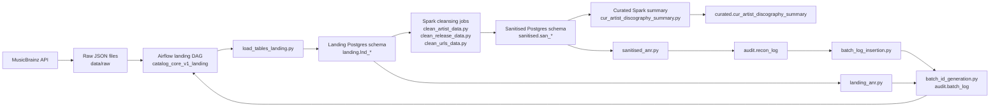

# Music Catalog ETL

This repository implements a small batch ETL pipeline around MusicBrainz API metadata. The code pulls artist, release, and URL relationship payloads from MusicBrainz, stores them as raw JSON in the repository’s data folders, loads the landing layer into PostgreSQL, applies Spark-based cleansing, writes a sanitised layer, and produces a small curated summary table for analytics queries.

The project is intentionally lightweight and exploratory. It is not a production-grade warehouse in the sense of having full CI, monitoring, alerting, schema versioning, or a mature test suite. What it does have is a working project shape for a few ETL concepts: Airflow DAG orchestration, batch IDs, audit/reconciliation, JSON payload storage, PostgreSQL warehouses, and Spark transformations.

## Overview

The source system is the MusicBrainz public API. The pipeline reads a sample set of artist and release entities and URL relationships, then writes a local copy of the raw responses before loading them into the database.

The repository is organised around a simple flow:

```text
MusicBrainz API
  -> raw JSON files under data/raw
  -> landing tables in Postgres
  -> Spark JSON parsing and shape-normalisation
  -> sanitised tables in Postgres
  -> curated summary table(s)
  -> audit and reconciliation tables
```

The current implementation is centred on the `cv1` source system. The code and SQL scripts use `catalog_core_v1` naming in the folders that expose that pipeline. You can see that in the DAGs under the Airflow directory and in the source packages under `ingestion/`, `cleansing/`, and `curation/`.

## Architecture

At a high level, the repository is a local containerised data stack that has three main runtime concerns:

- Airflow is the orchestrator. It defines the pipeline schedule and executes shell commands that call the ETL utilities.
- PostgreSQL is the warehouse substrate. It stores the landing, sanitised, curated, and audit tables.
- Spark reads the landing JSON payloads from PostgreSQL, extracts structures from `JSONB`/payload columns, and writes the sanitised tables.

The Docker Compose files define a small local environment with:

- an Airflow metadata Postgres instance (`postgres`)
- an ETL warehouse Postgres instance (`postgres-etl`)
- an Airflow webserver and scheduler
- a Spark master and worker
- a pgAdmin UI

The code is not strongly layered around interfaces or service modules. Most of the controlled movement happens through shell commands started by Airflow and Python scripts reaching directly into PostgreSQL and Spark.



## Data Flow

The main operational flow is visible in the DAGs and helper scripts.

1. A new batch is opened.
   - The landing DAG calls `batch_id_generation.py`.
   - That script inserts a row into `audit.batch_log` with a new `etl_batch_id` such as `20260730173828_cv1` and stores the batch ID in a file under `configs/`.

2. Source data is discovered and saved.
   - `ingestion/catalog_core_v1/ingestion_artists_etl_landing.py` calls the MusicBrainz API through the client in `generic_scripts/utils/musicbrainz_client.py`.
   - `discover_artists()` searches for artist names starting with random letters, filters artists with a score threshold, and selects a sample.
   - `fetch_releases()` pulls releases for the selected artists and `fetch_urls()` follows release relationships to fetch URL payloads.
   - Those payloads are saved to `data/raw/artists`, `data/raw/releases`, and `data/raw/urls` as timestamped JSON files.

3. Landing tables are populated.
   - Airflow runs `load_tables_landing.py` three times for artists, releases, and URLs.
   - `load_tables_landing.py` reads the latest raw JSON file, maps columns from the destination DB table, and inserts the raw entity payloads into the landing layer.
   - The landing schema definitions are in SQL under `sql/landing/`.

4. Landing ANR validates counts.
   - `landing_anr.py` compares the number of records found in the raw JSON file with the number of records inserted into the landing table for the current `etl_batch_id`.
   - A success or failure is written back to `audit.batch_log` as the landing phase status.

5. The raw files are pruned.
   - `landing_archival.py` removes older JSON files and keeps a small number of recent ones.

6. Spark sanitisation reads the landing layer.
   - The `catalog_core_v1_sanitised` DAG starts three Spark applications in parallel:
     - `clean_artist_data.py`
     - `clean_release_data.py`
     - `clean_urls_data.py`
   - Each script reads from `landing.lnd_artists`, `landing.lnd_releases`, and `landing.lnd_urls`, extracts the JSON payload using a schema, and emits a flattened dataset for the sanitised layer.

7. Reconciliation logs the landing-to-sanitised movement.
   - `sanitised_anr.py` counts the rows in the landing and sanitised tables for the current batch ID and writes a row to `audit.recon_log`.
   - `batch_log_insertion.py` summarises those reconciliation rows and updates the sanitised phase status in `audit.batch_log`.

8. A curated dataset is produced.
   - The curation DAG executes the Spark script `cur_artist_discography_summary.py`.
   - It reads `sanitised.san_artists` and `sanitised.san_releases` and creates a curated artist/discography-style summary in `curated.cur_artist_discography_summary`.
   - There is also a stubbed curation script for release/label summary under `curation/catalog_core_v1/cur_label_release_summary.py`, but it does not yet define a meaningful SQL aggregation.

## Data Model

The current warehouse layer is split across four main schema families:

### Landing layer

The SQL for landing setup is in [sql/landing/create_landing_tables.sql](sql/landing/create_landing_tables.sql).

The landing tables are:

- `landing.lnd_artists`
- `landing.lnd_releases`
- `landing.lnd_recordings`
- `landing.lnd_urls`

The pattern is the same for each landing table:

- `id` is the table-level identifier for the source entity
- `payload` is a PostgreSQL `JSONB` field storing the whole API payload
- `created_at` and `updated_at` are timestamps
- `lnd_releases` carries a `queried_artist_id` since releases are requested from an artist query

The folder also has a `recordings` source path and a SQL table definition, but the active Airflow DAGs do not currently run a recordings landing load or recordings clean/sanitise pipeline.

### Sanitised layer

The SQL for sanitised tables is in [sql/sanitised/create_sanitised_tables.sql](sql/sanitised/catalog_core_sanitised_tables.sql) and [sql/sanitised/catalog_core_sanitised_tables.sql](sql/sanitised/catalog_core_sanitised_tables.sql).

The tables are:

- `sanitised.san_artists`
- `sanitised.san_releases`
- `sanitised.san_urls`

The Spark cleaning steps flatten the original nested JSON payload into relational columns such as artist name, title, release ID, area, label, domain, and URL type. The code uses `from_json` against a Spark schema to map fields out of the stored payload JSON. In the current code, there is no `san_recordings` table written by the active DAG, even though the SQL layer defines a `san_recordings` table in one of the schema files.

### Curated layer

The curated model is small and derived from the sanitised layer.

- `curated.cur_artist_discography_summary` is created by `cur_artist_discography_summary.py`.
- The SQL that declares this curated table is in [sql/curated/catalog_core_curated_tables.sql](sql/curated/catalog_core_curated_tables.sql).

This specific curated table is a materialised summary keyed on `artist_id` and carries columns such as totals for releases, distinct release groups, average track count, and release-date range.

The repository also contains a second curated Python file for `cur_label_release_summary.py`, but it currently contains no useful SQL — it is not a real implementation yet.

### Audit and reconciliation layer

The audit tables are declared under [sql/audit/batch_log.sql](sql/audit/batch_log.sql) and [sql/audit/recon_log.sql](sql/audit/recon_log.sql).

Important points:

- `audit.batch_log` is the main batch ledger. It stores `etl_batch_id`, `phase_name`, `source_system`, `batch_status`, processed/failed counts, and error strings.
- `audit.recon_log` stores the landing-versus-sanitised comparisons for each table group. It has specialised columns for `source_table`, `target_table`, `group_name`, and the `recon_status` flag.

Audit status values are encoded as characters:

- `S` = started
- `C` = completed
- `E` = error / failed reconciliation

The batch ID is generated by `batch_id_generation.py`, written to a batch file in `configs/`, and read back by the downstream Python scripts for the same run.

## Pipeline / ETL Flow

The main pipeline is a batch pipeline rather than a streaming implementation.

The current execution order is the one encoded in the landing DAG:

```text
batch_id_generation.py
  -> ingestion_artists_etl_landing.py
  -> load_tables_landing.py (artists)
  -> load_tables_landing.py (releases)
  -> load_tables_landing.py (urls)
  -> landing_anr.py (artists, releases, urls)
  -> landing_archival.py
```

The sanitised DAG is then triggered separately:

```text
Spark clean_artist_data.py
Spark clean_release_data.py
Spark clean_urls_data.py
  -> sanitised_anr.py for the landing/sanitised counts
  -> batch_log_insertion.py
```

The curation DAG is a separate step that reads already-sanitised data and writes the curated summary table.

## Technology Stack

This repository is not using a broad technology surface; it is using the components that are visible in code and configuration.

- Python: ingestion, orchestration helpers, API client, and database utilities
- Apache Airflow: DAG orchestration and task execution
- PostgreSQL: the application warehouse, landing, sanitised, curated, and audit repositories
- Spark: DataFrame-based parsing and flattening into sanitised tables
- MusicBrainz API: source system for the payloads
- Docker Compose: local runtime environment
- pgAdmin: database admin UI

There is no evidence here for Kafka, DBT, Snowflake, Redis, or a complete CI/CD deployment story.

## Repository Structure

```text
Music_Catalog_ETL/
├── airflow/dags/                  # Airflow DAGs for landing, sanitised, curation
├── cleansing/catalog_core_v1/     # Spark cleaning jobs for landing payloads
├── curation/catalog_core_v1/       # Curated view/summary generation scripts
├── data/raw/                       # Raw MusicBrainz JSON payloads by entity
├── generic_scripts/                # Batch audit, loading, reconciliation, and DB utilities
├── ingestion/catalog_core_v1/      # API discovery and ingestion entrypoint
├── sql/landing                     # Landing table DDL
├── sql/sanitised                   # Sanitised data model DDL
├── sql/curated                     # Curated table DDL
├── sql/audit                       # Audit and reconciliation DDL
├── configs/                        # Current batch ID file and source-specific batch metadata
├── spark/jobs/                     # Spark runtime workspace
├── docker-compose.local.yml        # Primary local compose file
└── docker-compose.shared.yml       # Duplicate Compose reference file
```

## Database and Process Notes

The code is built around a small database name `music_catalog` on the PostgreSQL ETL service. The Postgres connection details are hardcoded in the helper file `generic_scripts/utils/postgres_connection.py` and `generic_scripts/utils/db_config.py`:

- host: `postgres-etl`
- port: `5432`
- database: `music_catalog`
- user: `etl`
- password: `etl`

The Airflow metadata database is separate and uses the `postgres` Compose service with database `airflow` and credentials `airflow` / `airflow`.

The live database was not reachable from this workspace during inspection, so the database evidence here comes from the SQL DDL, Python connection strings, and repository conventions rather than a fresh live catalogue query.

## Setup

The repository expects a local Docker environment.

Prerequisites visible in the repo:

- Docker and Docker Compose
- Python 3.12+ declared in the project metadata
- PostgreSQL client support for the Python runtime
- Access to the MusicBrainz API

The relevant runtime definitions are in the Compose files.

Start the environment as:

```bash
docker compose -f docker-compose.local.yml up --build
```

The stack already mounts project code into the Airflow and Spark services. The Airflow entrypoint is `entrypoint.sh`, which waits for Postgres, runs `airflow db migrate`, and creates a default admin user.

Once the containers are running, the DAGs can be observed through the Airflow UI at the webserver port declared in Compose: `8082` is mapped to `8080` in the webserver container.

The database can be reached through pgAdmin at port `5050` or directly at the host/ports declared in Compose (`5432` for the Airflow metadata database and `5434` for the ETL warehouse).

## Running the Pipeline

The expected pipeline entrypoint is the Airflow DAG `catalog_core_v1_landing` followed by the sanitised and curation DAGs.

Manual execution is mostly shell-driven. Examples from the repository are:

```bash
python generic_scripts/batch_id_generation.py cv1 landing
python ingestion/catalog_core_v1/ingestion_artists_etl_landing.py
python generic_scripts/load_tables_landing.py artists landing lnd_artists cv1
python generic_scripts/load_tables_landing.py releases landing lnd_releases cv1
python generic_scripts/load_tables_landing.py urls landing lnd_urls cv1
python generic_scripts/landing_anr.py artists landing lnd_artists cv1
python generic_scripts/sanitised_anr.py landing lnd_artists sanitised san_artists cv1 group1
python generic_scripts/batch_log_insertion.py group1 cv1
```

Those commands are the pieces exposed in the repository. The Airflow DAG wires them in a specific task order.

## Key Engineering Decisions

There are a few concrete design decisions visible in the code:

- The data is intentionally staged by source phases. The pipeline records `landing`, `sanitised`, and `curated` as separate database layers.
- The landing layer stores full API payloads in `JSONB`/JSON files. That preserves the original response shape before flattening it.
- Every pipeline run is tied to a `etl_batch_id`. The `audit.batch_log` table is the ledger for that run.
- The code tries to enforce row-level reconciliation through row counts between successive layers. Those counts are persisted in `audit.recon_log`.
- The Airflow DAG is responsible for sequencing operations and external process calls rather than doing transformation itself. Spark handles the flattening.
- The project keeps raw files around long enough to support reloading but not indefinitely. `landing_archival.py` removes older files.

## Things to Know

If you are joining this project, the main things worth knowing are:

- The shape of the current implementation is `cv1` and it is MusicBrainz-oriented.
- Artist, release, and URL entities are the only live landing payloads currently wired through the landing DAG.
- The recordings entity exists in the SQL and raw data tree but is not actively orchestrated through the main DAG.
- `curation` is at a very early state. The active curated output is only the artist discography summary.
- The codebase is not using a migration framework or a real DBT build. The warehouse schema is defined by SQL files and manual procedural scripts.
- There are no meaningful Python tests in the `tests/` directory; the repository’s current test coverage is effectively empty.

## Known Limitations / TODOs

This project is a learning and exploration repository, and a number of gaps are visible in the implementation.

- The database connection is hardcoded and uses shared credentials in source files. This is fine for a local containerised project, but it is not a security-forward setup.
- The landing table DDL and the runtime loading logic do not appear to be fully aligned on the presence of the `etl_batch_id` column. The serialised Python helpers assume this column may exist, but the simple SQL file does not declare it for landing tables.
- The recordings pipeline is incomplete: the SQL includes a landing and sanitised table shape for recordings, and raw files are present, but there is no active orchestration path for that entity.
- The curation layer has a placeholder `cur_label_release_summary.py` that is not used in a meaningful way.
- There is no live evidence of the database being connected to the current workspace session. The Compose runtime may need to be started before the database can be inspected.
- The repository’s tests folder is only a placeholder and does not carry executable validation.

## Live Showcase

> TODO: Add live showcase details.

Potential items worth demonstrating:

- [ ] End-to-end execution from API fetch to landing DB write
- [ ] The landing-to-sanitised reconciliation pass
- [ ] The curated artist discography summary table
- [ ] Airflow DAG state and task ordering
- [ ] raw JSON and batch ID generation
- [ ] audit records in `audit.batch_log` and `audit.recon_log`
- [ ] Spark parsing of nested MusicBrainz payload structures

## Future Improvements

The next useful improvements would be:

- Replace the hardcoded Postgres credentials with environment-driven configuration and secrets management.
- Add a real integration or end-to-end validation layer around the main DAGs.
- Expand the active curation model beyond the author-only summary and implement the label/release summary path.
- Finish the recordings and perhaps other source entities so they land, clean, and reconcile in the same way as the current three active domains.
- Improve auditability with a real run-time status dashboard and stronger observability around Spark and Airflow logging.
- Document a proper initial database bootstrap story that creates the schemas and tables consistently with the scripts that later assume them.
